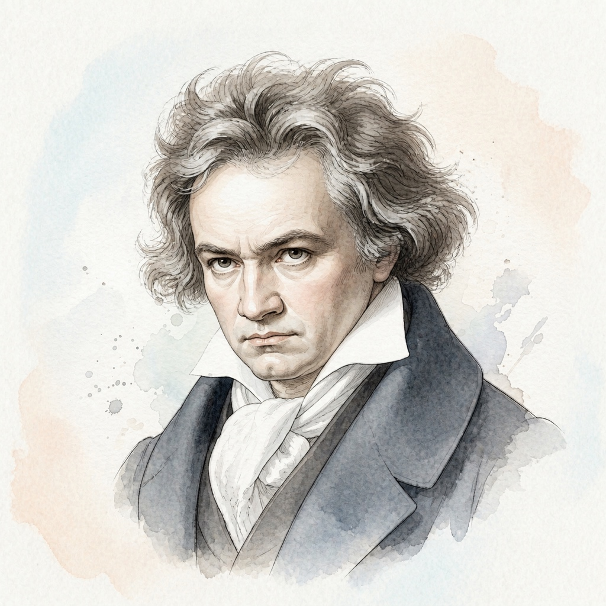

# 路德维希·凡·贝多芬 (Ludwig van Beethoven)

## 📌 基本信息

| 字段 | 信息 |
| :--- | :--- |
| **中文名** | 路德维希·凡·贝多芬 |
| **外文名** | Ludwig van Beethoven |
| **目录名称** | `Beethoven` |
| **生卒年月** | 1770年 － 1827年 |
| **国籍** | 德国 |
| **时期流派** | 维也纳古典乐派 / 早期浪漫主义 |
| **称号** | “乐圣 (The Titan of Classical Music)” |

---

## 📖 作家介绍与艺术生平

贝多芬出生于德国波恩，少年时期定居维也纳并师从海顿。青年时期以精湛绝伦的钢琴即兴演奏震撼维也纳乐坛，随后在中年时期遭遇严重的进行性耳聋打击。面对命运的重压，他以‘扼住命运的咽喉’的坚强意志创作出数量惊人的传世杰作。他的音乐突破了古典主义严谨的框框，开创了浪漫主义以个人情感、英雄主义与崇高意志为核心的音乐新纪元。其32首钢琴奏鸣曲集思想深度、结构交响化与演奏技巧于一体，与巴赫《平均律键盘曲集》并称为钢琴艺术史上不可逾越的双峰。

---

## 🎹 代表体裁与经典作品

1. **升c小调第十四钢琴奏鸣曲「月光」** (Op.27 No.2) — *Piano Sonata*
2. **c小调第八钢琴奏鸣曲「悲怆」** (Op.13) — *Piano Sonata*
3. **f小调第二十三钢琴奏鸣曲「热情」** (Op.57) — *Piano Sonata*
4. **C大调第二十一钢琴奏鸣曲「华尔斯坦/黎明」** (Op.53) — *Piano Sonata*
5. **降E大调第二十六钢琴奏鸣曲「告别」** (Op.81a) — *Piano Sonata*
6. **致爱丽丝 (Für Elise)** (WoO 59) — *Bagatelle*
7. **G大调小奏鸣曲** (Anh.5 No.1) — *Sonatina*
8. **F大调小奏鸣曲** (Anh.5 No.2) — *Sonatina*

---

## 🎼 本地乐谱库对应专集目录

- `/KernScores/beethoven`
- `/Sonatinas/Beethoven`

---

## 🎨 视觉资产规范

- **标准矩形头像 (`avatar.jpg`)**: 1:1 纯矩形 JPG 格式，淡雅水彩工笔插画，水彩背景完整延展填满矩形。
- **全景情境插画 (`illustration.jpg`)**: 1:1 音乐家艺术演奏/创作情境图。