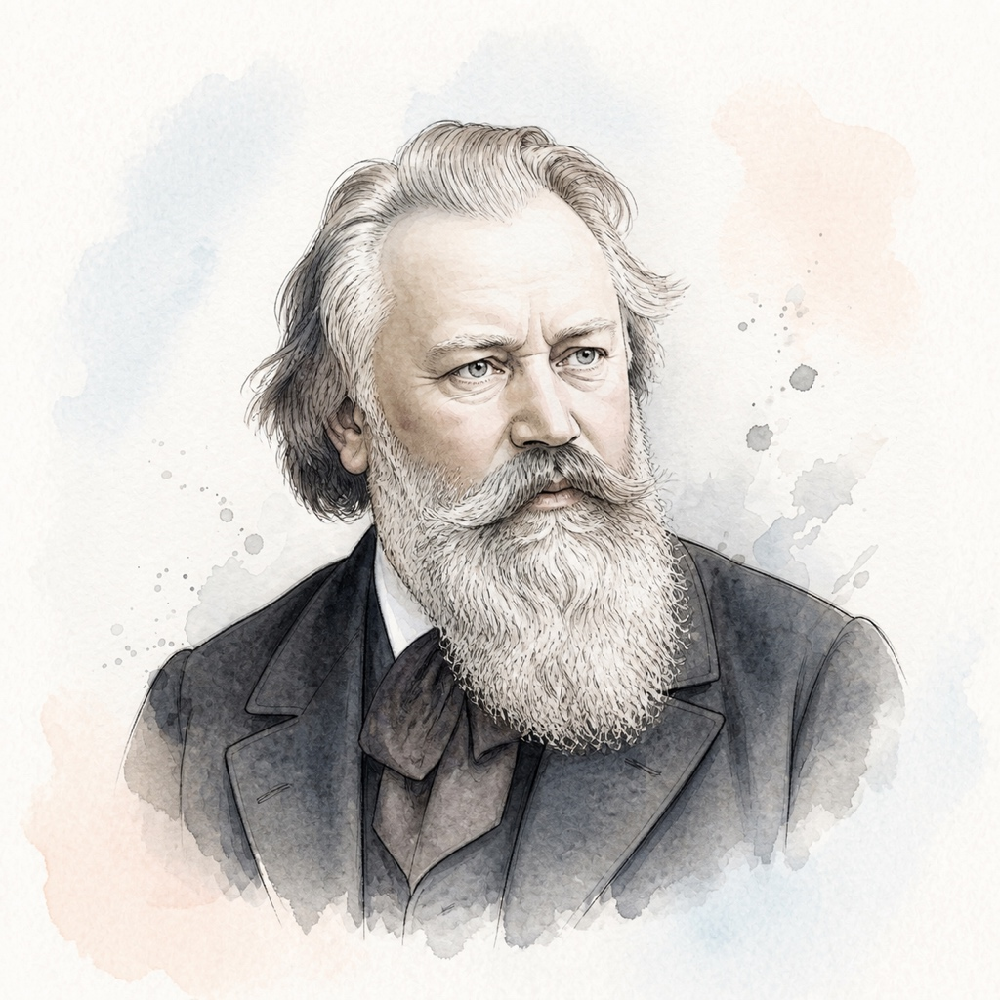

# 约翰内斯·勃拉姆斯 (Johannes Brahms)

## 📌 基本信息

| 字段 | 信息 |
| :--- | :--- |
| **中文名** | 约翰内斯·勃拉姆斯 |
| **外文名** | Johannes Brahms |
| **目录名称** | `Brahms` |
| **生卒年月** | 1833年 － 1897年 |
| **国籍** | 德国 |
| **时期流派** | 浪漫主义全盛期 (Romantic) |
| **称号** | “古典传统的坚守者 / 三B巨匠之一” |

---

## 📖 作家介绍与艺术生平

勃拉姆斯出生于汉堡，青年时期受到舒曼夫妇的大力推介。在19世纪激进的新德意志乐派狂潮中，勃拉姆斯坚持严格继承巴赫的对位法与贝多芬的古典奏鸣曲严密架构，创造出宏大雄浑与深沉内敛并存的崇高艺术风格。他的晚期钢琴小品集（Op.116至119间奏曲、狂想曲、叙事曲）被誉为‘写给钢琴的暮年沉思诗篇’。

---

## 🎹 代表体裁与经典作品

1. **b小调狂想曲** (Op.79 No.1) — *Rhapsody*
2. **g小调狂想曲** (Op.79 No.2) — *Rhapsody*
3. **A大调间奏曲** (Op.118 No.2) — *Intermezzo*
4. **降E大调圆舞曲** (Op.39 No.15) — *Waltz*
5. **匈牙利舞曲第五号 (钢琴版)** (WoO 1 No.5) — *Dance*
6. **帕格尼尼主题变奏曲** (Op.35) — *Variations*

---

## 🎼 本地乐谱库对应专集目录

- `/KernScores/brahms`
- `/OpenScore/Brahms`

---

## 🎨 视觉资产规范

- **标准矩形头像 (`avatar.jpg`)**: 1:1 纯矩形 JPG 格式，淡雅水彩工笔插画，水彩背景完整延展填满矩形。
- **全景情境插画 (`illustration.jpg`)**: 1:1 音乐家艺术演奏/创作情境图。