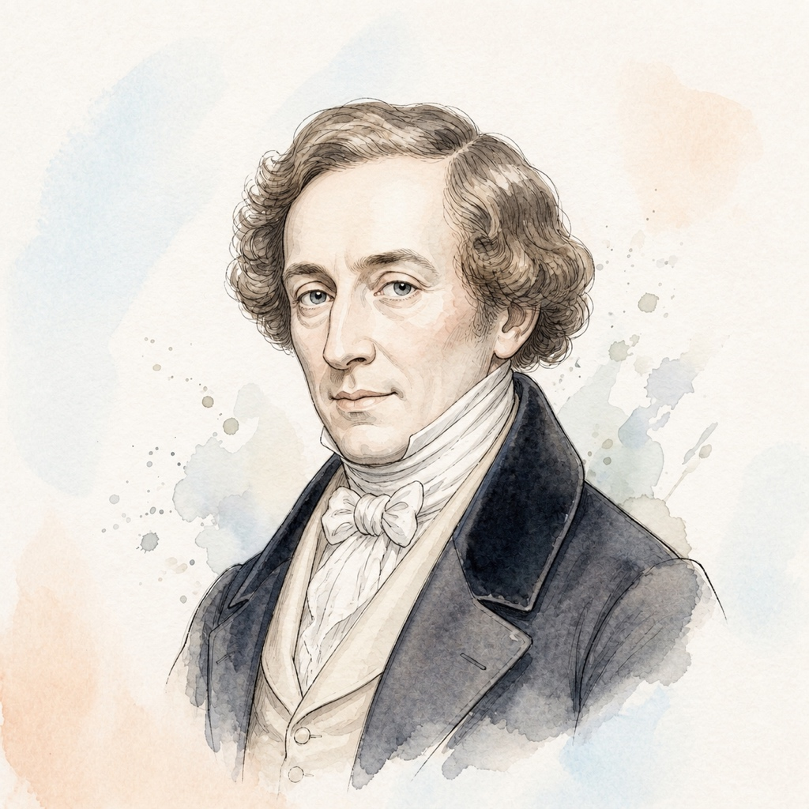

# 约瑟夫·弗里德里希·布格缪勒 (Johann Friedrich Franz Burgmüller)

## 📌 基本信息

| 字段 | 信息 |
| :--- | :--- |
| **中文名** | 约瑟夫·弗里德里希·布格缪勒 |
| **外文名** | Johann Friedrich Franz Burgmüller |
| **目录名称** | `Burgmuller` |
| **生卒年月** | 1806年 － 1874年 |
| **国籍** | 德国 / 法国 |
| **时期流派** | 浪漫主义时期 (Romantic) |
| **称号** | “钢琴叙事性进阶练习曲大师” |

---

## 📖 作家介绍与艺术生平

布格缪勒出生于德国雷根斯堡的音乐名门，后定居巴黎成为炙手可热的沙龙钢琴家与作曲家。布格缪勒最深远的影响力在于他创造性地将枯燥的手指机能练习转化为充满诗情画意、极具感染力的音乐小品。其《进阶练习曲 25 首 Op.100》（如《贵妇人的骑马》、《牧歌》、《阿拉伯风格曲》、《清澈的小溪》）旋律优美生动、形象鲜明，被公认为全球钢琴入门过渡到中级阶段最受喜爱的教学经典。

---

## 🎹 代表体裁与经典作品

1. **顺叙 / 坦率 (La Candeur)** (Op.100 No.1) — *Étude*
2. **阿拉伯风格曲 (Arabesque)** (Op.100 No.2) — *Étude*
3. **牧歌 (Pastoral)** (Op.100 No.3) — *Étude*
4. **清澈的溪水 (Le Courant Limpide)** (Op.100 No.7) — *Étude*
5. **再会 (L'Adieu)** (Op.100 No.12) — *Étude*
6. **安慰 (Consolation)** (Op.100 No.13) — *Étude*
7. **贵妇人的骑马 / 骑士 (La Chevaleresque)** (Op.100 No.25) — *Étude*
8. **18首风格练习曲 Op.109** (Op.109) — *Études*

---

## 🎼 本地乐谱库对应专集目录

- `/Burgmuller/Op_100`
- `/Burgmuller/Op_105`
- `/Burgmuller/Op_109`

---

## 🎨 视觉资产规范

- **标准矩形头像 (`avatar.jpg`)**: 1:1 纯矩形 JPG 格式，淡雅水彩工笔插画，水彩背景完整延展填满矩形。
- **全景情境插画 (`illustration.jpg`)**: 1:1 音乐家艺术演奏/创作情境图。