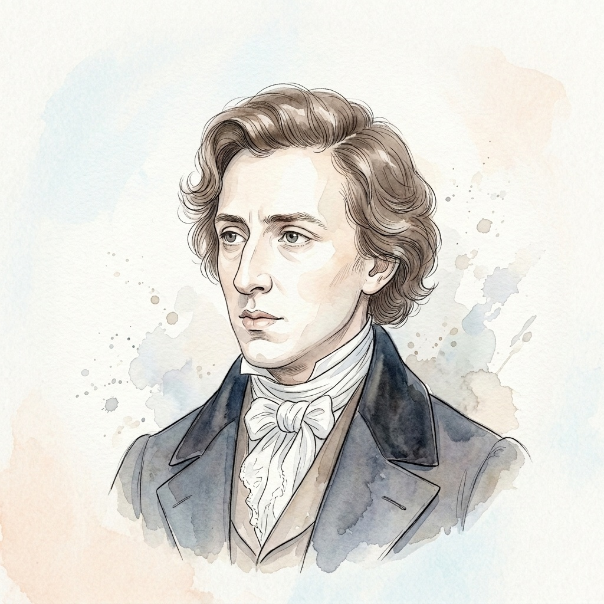

# 弗雷德里克·肖邦 (Frédéric François Chopin)

## 📌 基本信息

| 字段 | 信息 |
| :--- | :--- |
| **中文名** | 弗雷德里克·肖邦 |
| **外文名** | Frédéric François Chopin |
| **目录名称** | `Chopin` |
| **生卒年月** | 1810年 － 1849年 |
| **国籍** | 波兰 / 法国 |
| **时期流派** | 浪漫主义时期 (Romantic) |
| **称号** | “钢琴诗人 (The Poet of the Piano)” |

---

## 📖 作家介绍与艺术生平

弗雷德里克·肖邦出生于波兰华沙附近的热拉佐瓦-沃拉。二十岁时前往巴黎并在欧洲音乐界赢得极高声誉。肖邦将波兰传统的民间音乐语汇（如玛祖卡、波兰舞曲）与典雅的法式沙龙文化相融合，创作出兼具深沉爱国情怀与诗意色彩的永恒杰作。他的音乐旋律优美动人、和声丰富，是浪漫主义钢琴音乐的最高典范。

---

## 🎹 代表体裁与经典作品

1. **降E大调夜曲 Op.9 No.2** (Op.9 No.2) — *Nocturne*
2. **升c小调夜曲 遗作** (B.49) — *Nocturne*
3. **c小调练习曲「革命」** (Op.10 No.12) — *Étude*
4. **E大调练习曲「离别」** (Op.10 No.3) — *Étude*
5. **降D大调「一分钟/小狗圆舞曲」** (Op.64 No.1) — *Waltz*
6. **升c小调圆舞曲** (Op.64 No.2) — *Waltz*
7. **降A大调「英雄波兰舞曲」** (Op.53) — *Polonaise*
8. **24首前奏曲「雨滴」** (Op.28 No.15) — *Prelude*
9. **g小调第一叙事曲** (Op.23) — *Ballade*

---

## 🎼 本地乐谱库对应专集目录

- `/scores/KernScores/chopin`

---

## 🎨 视觉资产规范

- **标准矩形头像 (`avatar.jpg`)**: 1:1 纯矩形 JPG 格式，淡雅水彩工笔插画，水彩背景完整延展填满矩形。
- **全景情境插画 (`illustration.jpg`)**: 1:1 音乐家艺术演奏/创作情境图。