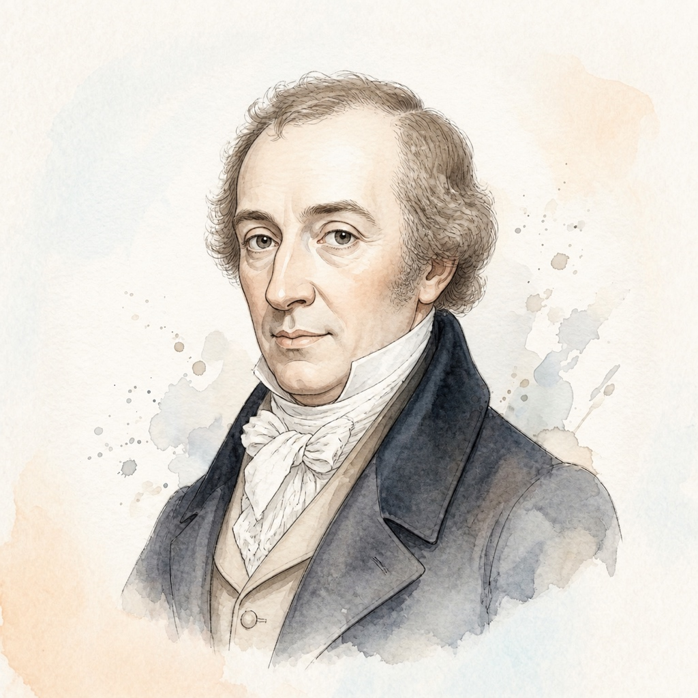

# 穆齐奥·克莱门蒂 (Muzio Clementi)

## 📌 基本信息

| 字段 | 信息 |
| :--- | :--- |
| **中文名** | 穆齐奥·克莱门蒂 |
| **外文名** | Muzio Clementi |
| **目录名称** | `Clementi` |
| **生卒年月** | 1752年 － 1832年 |
| **国籍** | 意大利 / 英国 |
| **时期流派** | 古典主义时期 (Classical) |
| **称号** | “现代钢琴演奏之父 / 小奏鸣曲宗师” |

---

## 📖 作家介绍与艺术生平

克莱门蒂出生于罗马，长期活跃于伦敦。他是最早完全针对现代击弦钢琴（而非羽管键琴）的机械性能与发音特质进行系统创作和演奏的先驱。曾与青年莫扎特在维也纳宫廷进行举世瞩目的钢琴演奏对决。他的《6首小奏鸣曲 Op.36》结构紧凑明快、乐句清晰匀称、指法规范严谨，是所有学习古典奏鸣曲结构与双手平衡控制最重要的必修阶梯。

---

## 🎹 代表体裁与经典作品

1. **C大调小奏鸣曲 第一乐章快板** (Op.36 No.1) — *Sonatina*
2. **G大调小奏鸣曲** (Op.36 No.2) — *Sonatina*
3. **C大调小奏鸣曲** (Op.36 No.3) — *Sonatina*
4. **F大调小奏鸣曲** (Op.36 No.4) — *Sonatina*
5. **G大调小奏鸣曲** (Op.36 No.5) — *Sonatina*
6. **D大调小奏鸣曲** (Op.36 No.6) — *Sonatina*
7. **名手之道 (Gradus ad Parnassum, 练习曲100首)** (Op.44) — *Études*

---

## 🎼 本地乐谱库对应专集目录

- `/Sonatinas/Clementi_Op36`

---

## 🎨 视觉资产规范

- **标准矩形头像 (`avatar.jpg`)**: 1:1 纯矩形 JPG 格式，淡雅水彩工笔插画，水彩背景完整延展填满矩形。
- **全景情境插画 (`illustration.jpg`)**: 1:1 音乐家艺术演奏/创作情境图。