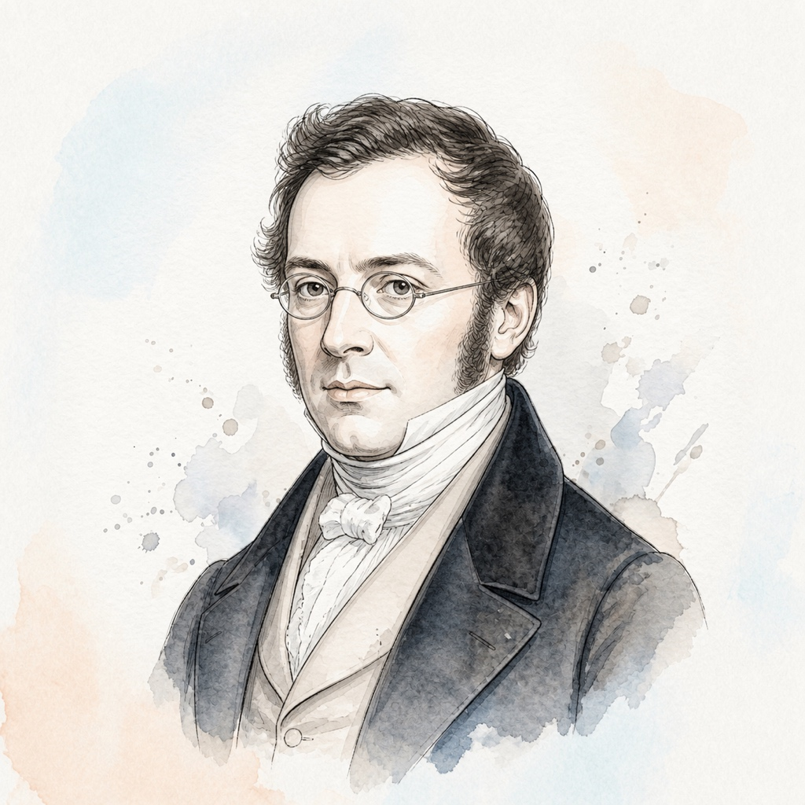

# 卡尔·车尔尼 (Carl Czerny)

## 📌 基本信息

| 字段 | 信息 |
| :--- | :--- |
| **中文名** | 卡尔·车尔尼 |
| **外文名** | Carl Czerny |
| **目录名称** | `Czerny` |
| **生卒年月** | 1791年 － 1857年 |
| **国籍** | 奥地利 |
| **时期流派** | 浪漫主义时期 / 维也纳古典传统 |
| **称号** | “现代钢琴教学之父” |

---

## 📖 作家介绍与艺术生平

车尔尼自幼随贝多芬学习钢琴，继承了维也纳古典乐派严谨规范的演奏法，随后培养出包括李斯特（Franz Liszt）、莱谢蒂茨基（Leschetizky）等一大批钢琴巨匠。车尔尼一生创作了超过千部作品，其中以循序渐进、体系完备的钢琴技巧练习曲最为举世瞩目。从《599 初级练习曲》、《849 流畅练习曲》到《299 快速练习曲》与《740 高级技巧练习曲》，构成了全球钢琴教育史上最具权威性、不可替代的技术教学大纲。

---

## 🎹 代表体裁与经典作品

1. **钢琴初步教程 Op.599 (全100首)** (Op.599) — *Études*
2. **钢琴流畅练习曲 Op.849 (全30首)** (Op.849) — *Études*
3. **钢琴快速练习曲 Op.299 (全40首)** (Op.299) — *Études*
4. **钢琴手指灵活性练习曲 Op.740 (全50首)** (Op.740) — *Études*
5. **左手练习曲 Op.718** (Op.718) — *Études*
6. **小小钢琴家 Op.823** (Op.823) — *Études*

---

## 🎼 本地乐谱库对应专集目录

- `/scores/Czerny/Op_599`
- `/scores/Czerny/Op_849`
- `/scores/Czerny/Op_299`
- `/scores/Czerny/Op_740`

---

## 🎨 视觉资产规范

- **标准矩形头像 (`avatar.jpg`)**: 1:1 纯矩形 JPG 格式，淡雅水彩工笔插画，水彩背景完整延展填满矩形。
- **全景情境插画 (`illustration.jpg`)**: 1:1 音乐家艺术演奏/创作情境图。