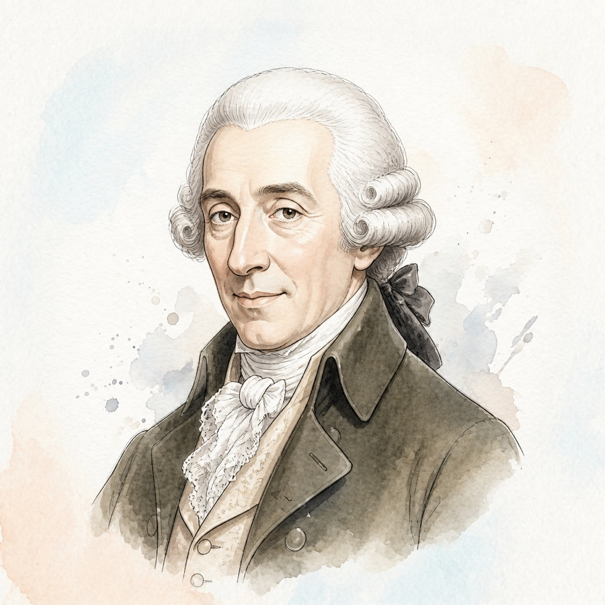

# 约瑟夫·海顿 (Franz Joseph Haydn)

## 📌 基本信息

| 字段 | 信息 |
| :--- | :--- |
| **中文名** | 约瑟夫·海顿 |
| **外文名** | Franz Joseph Haydn |
| **目录名称** | `Haydn` |
| **生卒年月** | 1732年 － 1809年 |
| **国籍** | 奥地利 |
| **时期流派** | 维也纳古典乐派 (Classical) |
| **称号** | “交响乐之父 / 弦乐四重奏之父” |

---

## 📖 作家介绍与艺术生平

海顿在埃斯特哈齐家族担任乐长近三十年，在长期的乐团实践中探索并奠定了交响曲、弦乐四重奏以及古典钢琴奏鸣曲的标准曲式框架。海顿不仅启发并指导了年轻的莫扎特与贝多芬，更以其乐观豁达、生动风趣的音乐性格为世人所爱。他的60余首键盘奏鸣曲构思精巧、充满民间音乐的质朴欢快与机智巧思，是古典键盘艺术不可或缺的基石。

---

## 🎹 代表体裁与经典作品

1. **D大调键盘奏鸣曲** (Hob. XVI:37) — *Keyboard Sonata*
2. **e小调键盘奏鸣曲** (Hob. XVI:34) — *Keyboard Sonata*
3. **C大调键盘奏鸣曲** (Hob. XVI:35) — *Keyboard Sonata*
4. **降E大调第五十二键盘奏鸣曲** (Hob. XVI:52) — *Keyboard Sonata*
5. **f小调行板与变奏曲** (Hob. XVII:6) — *Variations*
6. **吉普赛回旋曲** (Hob. XV:25) — *Rondo*

---

## 🎼 本地乐谱库对应专集目录

- `/scores/KernScores/haydn`

---

## 🎨 视觉资产规范

- **标准矩形头像 (`avatar.jpg`)**: 1:1 纯矩形 JPG 格式，淡雅水彩工笔插画，水彩背景完整延展填满矩形。
- **全景情境插画 (`illustration.jpg`)**: 1:1 音乐家艺术演奏/创作情境图。