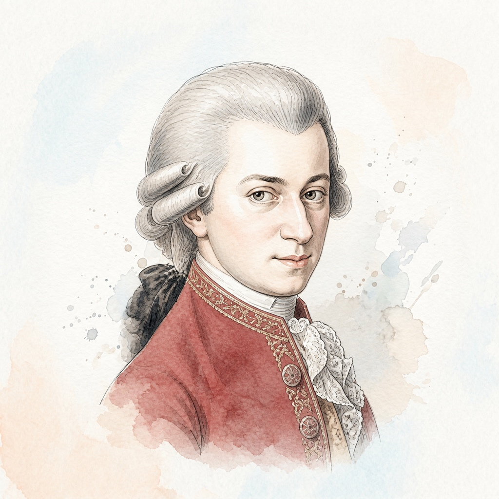

# 沃尔夫冈·阿玛多伊斯·莫扎特 (Wolfgang Amadeus Mozart)

## 📌 基本信息

| 字段 | 信息 |
| :--- | :--- |
| **中文名** | 沃尔夫冈·阿玛多伊斯·莫扎特 |
| **外文名** | Wolfgang Amadeus Mozart |
| **目录名称** | `Mozart` |
| **生卒年月** | 1756年 － 1791年 |
| **国籍** | 奥地利 |
| **时期流派** | 维也纳古典乐派 (Classical) |
| **称号** | “音乐神童 (The Musical Genius)” |

---

## 📖 作家介绍与艺术生平

莫扎特出生于奥地利萨尔茨堡，4岁开始作曲，自幼随父亲巡演全欧，展现出震古烁今的音乐早慧。在短暂而辉煌的35年生命中，莫扎特留下了600多部涵盖所有体裁的旷世杰作。莫扎特的钢琴作品结构严谨对称、织体明澈透亮，看似清丽流畅、无拘无束，实则蕴含极高的歌唱性与细腻复杂的情感张力。他的音乐被后世誉为‘降临人间的纯净阳光’。

---

## 🎹 代表体裁与经典作品

1. **A大调第十一钢琴奏鸣曲 (含「土耳其进行曲」)** (K.331) — *Piano Sonata*
2. **C大调第十六钢琴奏鸣曲 (易懂的奏鸣曲)** (K.545) — *Piano Sonata*
3. **F大调第十二钢琴奏鸣曲** (K.332) — *Piano Sonata*
4. **d小调幻想曲** (K.397) — *Fantasia*
5. **c小调幻想曲** (K.475) — *Fantasia*
6. **c小调第十四钢琴奏鸣曲** (K.457) — *Piano Sonata*
7. **小星星变奏曲** (K.265) — *Variations*
8. **C大调小奏鸣曲** (K.545) — *Sonatina*

---

## 🎼 本地乐谱库对应专集目录

- `/KernScores/mozart`
- `/Sonatinas/Mozart`

---

## 🎨 视觉资产规范

- **标准矩形头像 (`avatar.jpg`)**: 1:1 纯矩形 JPG 格式，淡雅水彩工笔插画，水彩背景完整延展填满矩形。
- **全景情境插画 (`illustration.jpg`)**: 1:1 音乐家艺术演奏/创作情境图。