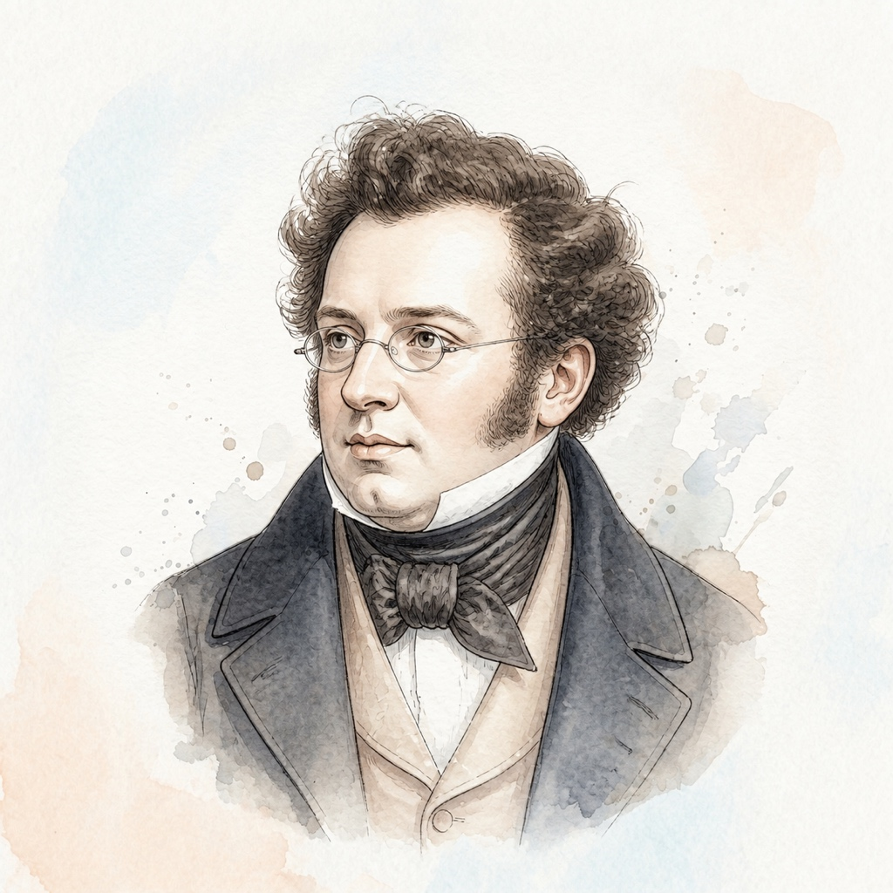

# 弗朗茨·舒伯特 (Franz Peter Schubert)

## 📌 基本信息

| 字段 | 信息 |
| :--- | :--- |
| **中文名** | 弗朗茨·舒伯特 |
| **外文名** | Franz Peter Schubert |
| **目录名称** | `Schubert` |
| **生卒年月** | 1797年 － 1828年 |
| **国籍** | 奥地利 |
| **时期流派** | 早期浪漫主义 (Romantic) |
| **称号** | “歌曲之王 / 浪漫主义抒情天才” |

---

## 📖 作家介绍与艺术生平

舒伯特生于维也纳，在极其贫困与病痛的短暂31年岁月中，创作了600多首不朽的艺术歌曲及大量室内乐与钢琴曲。舒伯特将德奥艺术歌曲中深邃动人的歌唱性完美移植到了钢琴独奏领域。他的《即兴曲集》(Op.90, Op.142) 与《音乐瞬间》(Moments Musicaux, Op.94) 旋律纯净悠扬、转调如梦如幻，深深启发了后来的肖邦、李斯特与勃拉姆斯。

---

## 🎹 代表体裁与经典作品

1. **f小调音乐瞬间 (Moments Musicaux No.3)** (Op.94 No.3) — *Musical Moment*
2. **降G大调即兴曲** (Op.90 No.3) — *Impromptu*
3. **降E大调即兴曲** (Op.90 No.2) — *Impromptu*
4. **c小调即兴曲** (Op.90 No.1) — *Impromptu*
5. **降B大调第二十一钢琴奏鸣曲** (D.960) — *Piano Sonata*
6. **军队进行曲** (D.733 No.1) — *March*

---

## 🎼 本地乐谱库对应专集目录

- `/KernScores/schubert`
- `/OpenScore/Schubert`

---

## 🎨 视觉资产规范

- **标准矩形头像 (`avatar.jpg`)**: 1:1 纯矩形 JPG 格式，淡雅水彩工笔插画，水彩背景完整延展填满矩形。
- **全景情境插画 (`illustration.jpg`)**: 1:1 音乐家艺术演奏/创作情境图。