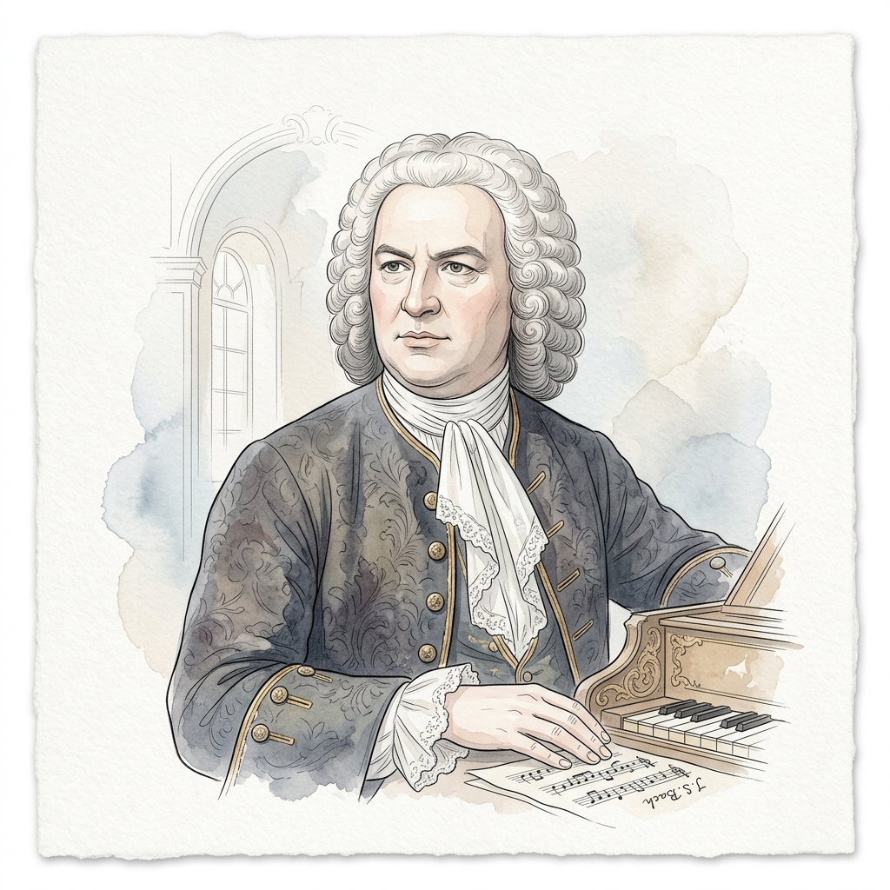

# 约翰·塞巴斯蒂安·巴赫 (Johann Sebastian Bach)

## 📌 基本信息

| 字段 | 信息 |
| :--- | :--- |
| **中文全名** | 约翰·塞巴斯蒂安·巴赫 |
| **外文名** | Johann Sebastian Bach |
| **生卒年月** | 1685年3月31日 － 1750年7月28日 |
| **国籍** | 德国 |
| **时期流派** | 巴洛克时期 (Baroque) |
| **称号** | “西方现代音乐之父” (The Father of Western Music) |

---

## 📖 作家介绍与艺术生平

约翰·塞巴斯蒂安·巴赫是巴洛克音乐时期的集大成者，也是整部西方古典音乐史中最伟大的奠基人之一。他将复调对位法（Counterpoint）、赋格（Fugue）以及调性体系的艺术可能推向了不可逾越的巅峰。

巴赫出生于德国图林根埃森纳赫的一个显赫音乐世家。他精通管风琴、羽管键琴、小提琴等多种乐器，并在魏玛、科滕、莱比锡等地担任乐长与圣托马斯合唱团乐监。巴赫的音乐兼具深邃的宗教神圣感、严密的数学逻辑结构与广袤博大的宇宙情怀，其创作奠定了近现代十二平均律键盘音乐与和声体系的基础。

他的《平均律键盘曲集》被音乐界公认为键盘乐器的“旧约圣经”，对后世莫扎特、贝多芬、肖邦、舒曼等无数大师产生了深远而决定性的影响。

---

## 🎹 代表体裁与经典作品

1. **平均律键盘曲集 (The Well-Tempered Clavier)**
   - *第一卷与第二卷 48首前奏曲与赋格 (BWV 846-893)*
   - *C大调前奏曲 BWV 846*
2. **初学者与家庭钢琴集 (Beginner & Clavierbüchlein)**
   - *《安娜·玛格达莱娜·巴赫笔记本》小步舞曲、进行曲 (BWV Anh. 114, 115等)*
   - *《二部创意曲》与《三部创意曲》(BWV 772-801)*
   - *《法国组曲》(BWV 812-817) 与《英国组曲》(BWV 806-811)*
3. **管风琴巨作 (Organ Works)**
   - *d小调托卡塔与赋格 BWV 565*
   - *c小调帕萨卡利亚与赋格 BWV 582*
4. **管弦乐与键盘协奏曲 (Concertos & Suites)**
   - *勃兰登堡协奏曲 (BWV 1046-1051)*
   - *哥德堡变奏曲 (Goldberg Variations, BWV 988)*
   - *G弦上的咏叹调 (选自第三管弦乐组曲 BWV 1068)*

---

## 🎨 视觉资产（淡雅水彩插画风格）

- **标准矩形头像 (`avatar.jpg`)**: 
  - **规格**：1:1 纯矩形 JPG 格式（画质 95%）
  - **特点**：巴赫经典卷发假发与巴洛克宫廷领巾肖像，淡雅水彩晕染满版无边框。
- **全景情境插画 (`illustration.jpg`)**: 
  - **规格**：1:1 演奏情境图 JPG 格式
  - **特点**：巴赫在巴洛克大教堂管风琴前演奏《帕萨卡利亚》手稿乐谱的宏伟圣洁场景。
